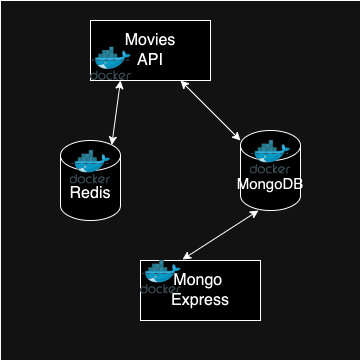

## Docker Assignment - Agile Software Practice.

__Name:__ James Hanlon

__Demo:__ https://youtu.be/J77fnGTLtWA

This repository contains the containerization of the mukti-container application illustrated below.

### Database Seeding.
I used the same mongo:8.0-rc iamge from the mongodb service as it will be based on the mongodb service. For initial data population, I set up a volume to mount a `seeding.json` file, enabling MongoDB to automatically load a predefined JSON array of movie data on the host machine and map it to `seed.json`. It uses the mongodb-network becsuse it only need access to the mongodb service. The command mongoimport is used to drop the exsiting data from `seeding.json`.

### M.ulti-Stack.

Setting up the development and production stack options was easier than I expected. I learned that if you add a profile to a service, then that service's profile name must be specified when running it. If you simply run `docker-compose up`, only the services without a defined profile will start (Production stack). Only added the Profile: `-dev` to seeding and mongo-express so they will be selectively run based on whether it is for development(dev), or production.
